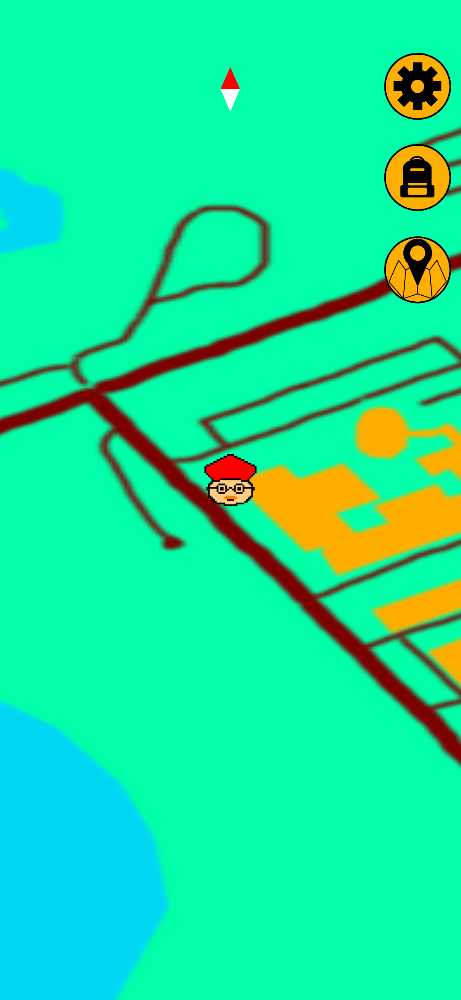
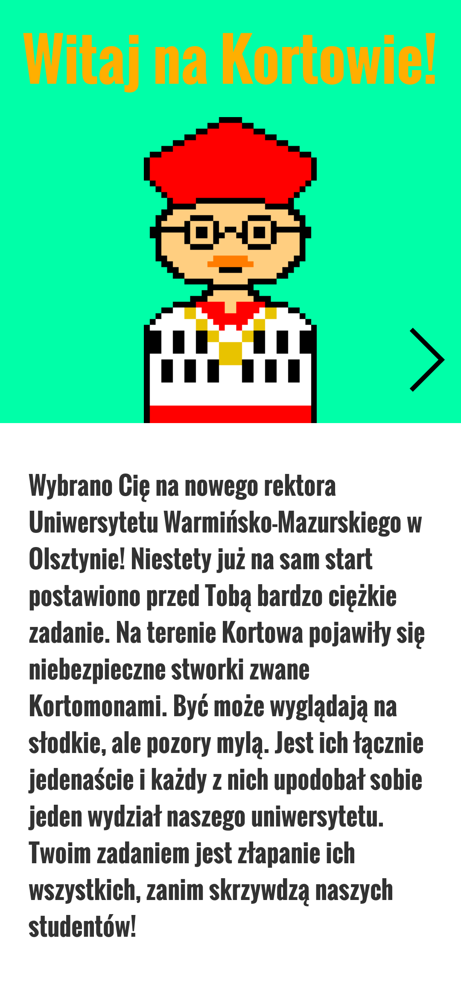
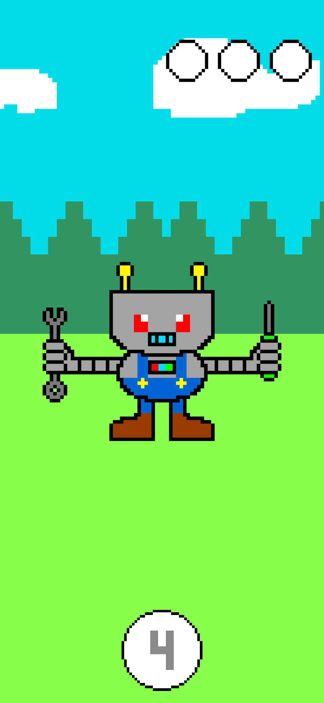
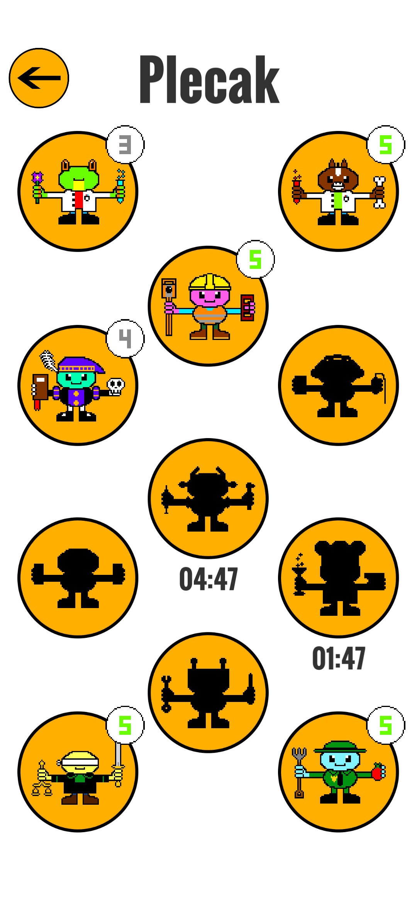

# Implementation of mobile game using GPS
#### Localization mobile game created in Unity for my Engineer's Thesis

## Table of Contents
* [General Info](#general-information)
* [Technologies Used](#technologies-used)
* [Features](#features)
* [Screenshots](#screenshots)
* [Setup](#setup)
* [Usage](#usage)
* [Project Status](#project-status)
* [Room for Improvement](#room-for-improvement)
* [Contact](#contact)

## General Information
- Kortomony is a simple game similar to Pokemon Go working on Android
- As a new rector of The University of Warmia and Mazury(UWM) in Olsztyn you have to catch dangerous creatures called Kortomons
- There are plenty of them, every one is connected to one of the faculties on Kortowo Campus
- Application is a subject of my Engineer's Thesis, that I defended on UWM with the highest grate

## Technologies Used
- Unity - version 2019.4.0f1
- Visual Studio 2019
- [Piskel](https://www.piskelapp.com/)

## Features
List the ready features here:
- Using GPS of your mobile device
- All graphic stuff was created by myself

## Screenshots

<!-- If you have screenshots you'd like to share, include them here. -->

## Setup
To run app on Android device just download and install [Kortomony.apk](./Kortomony.apk)

Proceed to describe how to install / setup one's local environment / get started with the project.

## Usage
How does one go about using it?
Provide various use cases and code examples here.

`write-your-code-here`

## Project Status
Project is: _in progress_ / _complete_ / _no longer being worked on_. If you are no longer working on it, provide reasons why.

## Room for Improvement
Include areas you believe need improvement / could be improved. Also add TODOs for future development.

Room for improvement:
- Improvement to be done 1
- Improvement to be done 2

To do:
- Feature to be added 1
- Feature to be added 2

## Contact
Created by [@flynerdpl](https://www.flynerd.pl/) - feel free to contact me!

<!-- Optional -->
<!-- ## License -->
<!-- This project is open source and available under the [... License](). -->

<!-- You don't have to include all sections - just the one's relevant to your project -->
